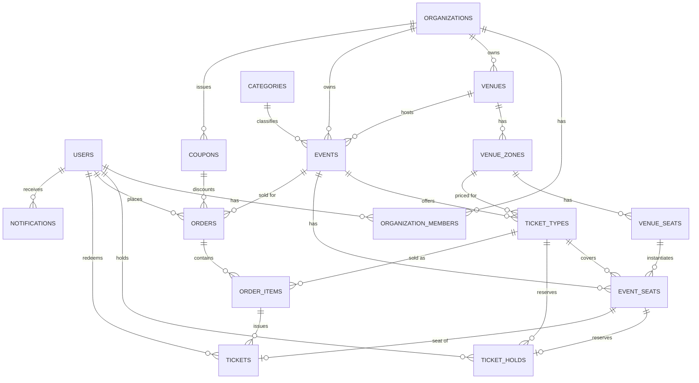
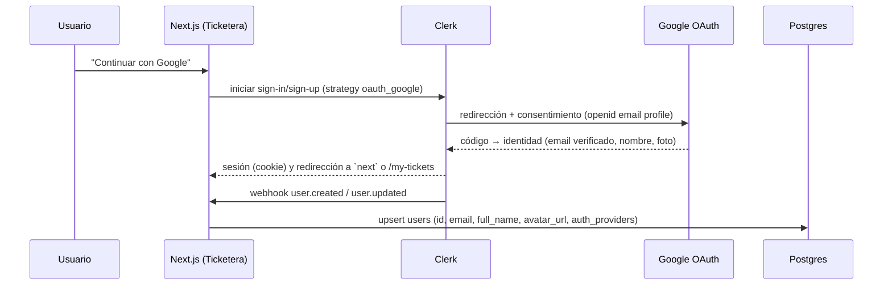

# Modelo de datos (MER) — Ticketera

**Estado**: draft
**Aprobado por**: (pendiente)

## Contexto

Este documento define el **modelo entidad-relación** de la base de datos real (Postgres — Neon en local, Cloud SQL en producción) para Ticketera: eventos, organizaciones, roles, entradas por zona/asiento, órdenes y pagos.

Hasta ahora el proyecto solo tiene UI con **datos mock** (`docs/specs/events/`, `docs/specs/tickets/purchase-flow.md`, `docs/specs/checkout/checkout-and-confirmation.md`, todos `done`), sin backend ni base de datos real. Este MER es la base de la implementación en Drizzle ORM: el schema TypeScript real vive en `src/db/schema/` y la migración inicial en `drizzle/` (ver "Implementación (Drizzle)"). Aplicar la migración contra Neon queda pendiente de configurar `DATABASE_URL`.

El modelo se diseñó reconciliando dos fuentes que en algunos puntos no coincidían:

1. El pedido original: roles (Super admin, Administrador, Organizador, Cliente), autenticación con Clerk (email/password + Google), pagos con Stripe, Google Maps en producción.
2. Lo que ya está **implementado y aprobado** en la UI mock: selección de entradas por **zona y asiento numerado** (`docs/specs/tickets/purchase-flow.md` — `VenueLayout`, `VenueZone`, `Seat`) y un checkout con métodos de pago peruanos (Tarjeta / Yape / PagoEfectivo, `docs/specs/checkout/checkout-and-confirmation.md`).

Decisión tomada con el usuario: el MER real **sí modela zonas y asientos** (no un modelo plano de "un precio por evento"), pero los pagos **solo cubren Stripe** en esta primera versión — Yape/PagoEfectivo siguen siendo opciones visuales del mock sin respaldo de pago real hasta que se decida un proveedor local (ver "Fuera de alcance").

## Decisiones de arquitectura

- **Autenticación**: **Clerk** con dos métodos: correo + contraseña y **Google (OAuth, social connection de Clerk)**. Clerk gestiona todo el flujo OAuth (redirección, consentimiento, tokens, sesión); la app **no** guarda contraseñas ni tokens de Google, ni implementa OAuth propio. Los scopes de Google se limitan a `openid email profile`. Si un correo ya existe con contraseña y entra con Google (o al revés), Clerk los enlaza en **una sola cuenta** siempre que el correo esté verificado — por eso `users.email` sigue siendo único. Reemplaza la sesión simulada de `useSessionStore` y el selector mock de `docs/specs/account/google-sign-in.md`.
- **Roles**: `users.is_super_admin` es un flag global, fuera de cualquier organización. Los roles son filas de la tabla `roles` (catálogo dinámico con permisos); `organization_members.role_id` indica el rol de un usuario *dentro* de una organización. `admin` y `organizer` son roles de sistema. `Cliente` es cualquier usuario sin membresías que compra entradas.
- **Organizaciones**: ~~Clerk Organizations~~ **(decisión revisada)**: las organizaciones y sus membresías (`organizations`, `organization_members`) **viven solo en Postgres** y las administra la propia app desde `/admin`; Clerk solo es la fuente de verdad de la **identidad** (`users`, sincronizada por webhook). Motivo: Clerk Organizations exige activarse en el dashboard y no aporta nada que la app no resuelva con sus propias tablas. Los ids son `org_<uuid>` / `mem_<uuid>` generados por la app.
- **Pagos**: **Stripe Connect** (marketplace) — cada organización tiene su cuenta conectada (`organizations.stripe_account_id`) y recibe el pago menos `orders.application_fee_amount`.
- **Entradas**: modelo de **zonas + asientos**, no un precio único por evento. Un `venue` tiene `venue_zones` (generales o numeradas); las zonas numeradas tienen `venue_seats` físicos reutilizables entre eventos del mismo recinto. El precio y disponibilidad se fijan **por evento** en `ticket_types` (un venue se reusa, pero el precio de un concierto no tiene por qué ser el de otro en el mismo lugar).
- **Reserva temporal (hold)**: el checkout ya aprobado reserva la selección por 10 minutos con cuenta regresiva (`docs/specs/checkout/checkout-and-confirmation.md`, AC-3). `ticket_holds` respalda esto: mientras el hold no expira, ese asiento/cupo no puede venderse a otro comprador.
- **Categorías**: tabla `categories` gestionable por Super admin, no un enum fijo en código.
- **Moneda**: `PEN` (soles), consistente con `Event.price` ya usado en la UI (`src/modules/events/types/event.types.ts`).
- **ORM**: Drizzle (`drizzle-orm` + `drizzle-kit`) sobre Neon (`@neondatabase/serverless`, driver HTTP). Instalado.

## Diagrama ER

## Entidades

### Identidad y organizaciones (sincronizadas desde Clerk vía webhook)

#### `users`

| Columna | Tipo | Notas |
|---|---|---|
| `id` | `text` PK | = Clerk user id (`user_...`) |
| `email` | `text` unique, not null | |
| `full_name` | `text` | nullable |
| `avatar_url` | `text` | nullable — con Google se llena con la foto de perfil |
| `email_verified` | `boolean` not null default `false` | `true` siempre con Google; base del enlace de cuentas |
| `auth_providers` | `text[]` not null default `'{}'` | métodos enlazados: `password`, `google`. Una cuenta puede tener ambos |
| `last_sign_in_at` | `timestamptz` | nullable |
| `is_super_admin` | `boolean` not null default `false` | flag global, fuera de cualquier org |
| `created_at` / `updated_at` | `timestamptz` not null | |

#### `organizations`

| Columna | Tipo | Notas |
|---|---|---|
| `id` | `text` PK | = Clerk organization id (`org_...`) |
| `name` | `text` not null | |
| `slug` | `text` unique, not null | |
| `logo_url` | `text` | nullable |
| `stripe_account_id` | `text` unique | nullable — cuenta Connect |
| `stripe_connect_status` | `text` enum `stripe_connect_status` not null default `not_started` | `not_started \| pending \| active \| restricted` |
| `created_at` / `updated_at` | `timestamptz` not null | |

#### `organization_members`

| Columna | Tipo | Notas |
|---|---|---|
| `id` | `text` PK | = Clerk organization membership id |
| `organization_id` | `text` FK → `organizations.id`, not null | |
| `user_id` | `text` FK → `users.id`, not null | |
| `role_id` | `text` FK → `roles.id` (on delete restrict), not null | Índice `organization_members_role_idx` |
| `created_at` | `timestamptz` not null | |

Restricción: único por `(organization_id, user_id)`.

#### `roles`

| Columna | Tipo | Notas |
|---|---|---|
| `id` | `text` PK | Roles de sistema: `admin`, `organizer` |
| `name` | `text` not null, único | |
| `description` | `text` | |
| `permissions` | `text[]` not null default `{}` | Permisos asignables (ver "Roles y permisos") |
| `is_system` | `boolean` not null default `false` | `true` para `admin` y `organizer` |
| `created_at` / `updated_at` | `timestamptz` not null | |

La migración `0001_dynamic_roles` crea la tabla y siembra los roles de sistema: `admin` ("Administrador": `members:manage`, `events:manage`, `tickets:redeem`) y `organizer` ("Organizador": `events:manage`, `tickets:redeem`). Migra `organization_members.role` a `role_id` y elimina el enum `org_role`. La migración se aplica manualmente con `npm run db:migrate`.

### Catálogo

#### `categories`

| Columna | Tipo | Notas |
|---|---|---|
| `id` | `uuid` PK default `gen_random_uuid()` | |
| `slug` | `text` unique, not null | |
| `label` | `text` not null | |
| `icon` | `text` | nullable, nombre de ícono lucide |
| `created_at` | `timestamptz` not null | |

Gestionada por Super admin (reemplaza el union type `EventCategory` hardcodeado de `event.types.ts`).

### Recinto (venue), reutilizable entre eventos

#### `venues`

| Columna | Tipo | Notas |
|---|---|---|
| `id` | `uuid` PK | |
| `organization_id` | `text` FK → `organizations.id`, not null | dueño del recinto |
| `name` | `text` not null | |
| `address_line` | `text` not null | |
| `city` | `text` not null | |
| `country` | `text` not null default `'PE'` | |
| `lat` / `lng` | `numeric(9,6)` | nullable hasta geocoding (Google Maps, solo prod) |
| `capacity` | `integer` | nullable |
| `created_at` / `updated_at` | `timestamptz` not null | |

#### `venue_zones`

| Columna | Tipo | Notas |
|---|---|---|
| `id` | `uuid` PK | |
| `venue_id` | `uuid` FK → `venues.id`, not null | |
| `name` | `text` not null | ej. "Tribuna Occidente" |
| `short_name` | `text` not null | etiqueta corta para móvil, ej. "Occidente" |
| `seating` | `text` enum `zone_seating` not null | `general \| numbered` |
| `shape` | `jsonb` not null | rect/polígono del mapa SVG (`{x,y,width,height}`) |
| `tone` | `smallint` not null | 1–5, escala visual (1 = más cara) — ver `design-system/ticketera/MASTER.md` § Color Palette, `--zone-1..5` |
| `sort_order` | `integer` not null default `0` | |
| `created_at` / `updated_at` | `timestamptz` not null | |

#### `venue_seats`

| Columna | Tipo | Notas |
|---|---|---|
| `id` | `uuid` PK | |
| `venue_zone_id` | `uuid` FK → `venue_zones.id`, not null | solo zonas `seating = 'numbered'` |
| `row_label` | `text` not null | ej. "B" |
| `seat_number` | `integer` not null | |
| `x` / `y` | `numeric` not null | coordenadas del mapa SVG |
| `created_at` | `timestamptz` not null | |

Restricción: único por `(venue_zone_id, row_label, seat_number)`.

### Eventos

#### `events`

| Columna | Tipo | Notas |
|---|---|---|
| `id` | `uuid` PK | |
| `organization_id` | `text` FK → `organizations.id`, not null | |
| `venue_id` | `uuid` FK → `venues.id`, not null | |
| `category_id` | `uuid` FK → `categories.id`, not null | |
| `title` | `text` not null | |
| `slug` | `text` unique, not null | |
| `description` | `text` | nullable |
| `cover_image_url` | `text` | nullable |
| `starts_at` | `timestamptz` not null | |
| `ends_at` | `timestamptz` | nullable |
| `doors_open_at` | `timestamptz` | nullable — ya existe como `EventDetail.doorsOpenAt` en la UI mock |
| `min_age` | `integer` | nullable — `null` = todo público, ya existe como `EventDetail.minAge` |
| `status` | `text` enum `event_status` not null default `draft` | `draft \| published \| cancelled` |
| `featured` | `boolean` not null default `false` | ya existe como `Event.featured` |
| `created_at` / `updated_at` | `timestamptz` not null | |

### Venta de entradas (por evento)

#### `ticket_types`

Precio y disponibilidad de una zona **para un evento específico** (el mismo venue puede tener precios distintos en cada evento).

| Columna | Tipo | Notas |
|---|---|---|
| `id` | `uuid` PK | |
| `event_id` | `uuid` FK → `events.id`, not null | |
| `venue_zone_id` | `uuid` FK → `venue_zones.id`, not null | |
| `name` | `text` not null | por defecto el nombre de la zona; puede sobreescribirse (ej. "VIP Campo") |
| `price` | `integer` not null | centavos |
| `currency` | `text` not null default `'PEN'` | |
| `quantity_total` | `integer` | **solo** cuando la zona es `general`; `null` si `numbered` (la capacidad sale de contar `event_seats`) |
| `quantity_sold` | `integer` not null default `0` | contador denormalizado |
| `sales_start_at` / `sales_end_at` | `timestamptz` | nullable |
| `created_at` / `updated_at` | `timestamptz` not null | |

Restricción: único por `(event_id, venue_zone_id)`.

#### `event_seats`

Una fila por asiento numerado **de un evento concreto** (instancia de `venue_seats` con estado de venta).

| Columna | Tipo | Notas |
|---|---|---|
| `id` | `uuid` PK | |
| `event_id` | `uuid` FK → `events.id`, not null | |
| `venue_seat_id` | `uuid` FK → `venue_seats.id`, not null | |
| `ticket_type_id` | `uuid` FK → `ticket_types.id`, not null | |
| `status` | `text` enum `seat_status` not null default `available` | `available \| held \| sold` |
| `created_at` / `updated_at` | `timestamptz` not null | |

Restricción: único por `(event_id, venue_seat_id)`.

#### `ticket_holds`

Respalda la reserva de 10 minutos ya implementada visualmente en `docs/specs/checkout/checkout-and-confirmation.md` (AC-3). Mientras un hold no expira, esa cantidad/asiento no está disponible para otro comprador.

| Columna | Tipo | Notas |
|---|---|---|
| `id` | `uuid` PK | |
| `ticket_type_id` | `uuid` FK → `ticket_types.id`, not null | |
| `event_seat_id` | `uuid` FK → `event_seats.id` | nullable — solo zonas `numbered` |
| `quantity` | `integer` not null default `1` | zonas `general`; siempre `1` en `numbered` |
| `user_id` | `text` FK → `users.id` | nullable — ver Preguntas abiertas (checkout como invitado) |
| `expires_at` | `timestamptz` not null | |
| `created_at` | `timestamptz` not null | |

### Promociones

#### `coupons`

| Columna | Tipo | Notas |
|---|---|---|
| `id` | `uuid` PK | |
| `organization_id` | `text` FK → `organizations.id`, not null | |
| `event_id` | `uuid` FK → `events.id` | nullable — `null` = aplica a todos los eventos de la org |
| `code` | `text` not null | único por organización |
| `discount_type` | `text` enum `discount_type` not null | `percentage \| fixed_amount` |
| `discount_value` | `integer` not null | |
| `max_redemptions` | `integer` | nullable |
| `redemptions_count` | `integer` not null default `0` | |
| `valid_from` / `valid_until` | `timestamptz` | nullable |
| `created_at` / `updated_at` | `timestamptz` not null | |

Restricción: único por `(organization_id, code)`.

### Órdenes y pago (Stripe)

#### `orders`

| Columna | Tipo | Notas |
|---|---|---|
| `id` | `uuid` PK | |
| `user_id` | `text` FK → `users.id`, not null | comprador |
| `event_id` | `uuid` FK → `events.id`, not null | |
| `status` | `text` enum `order_status` not null default `pending` | `pending \| paid \| cancelled \| refunded` |
| `stripe_checkout_session_id` | `text` unique | nullable |
| `stripe_payment_intent_id` | `text` unique | nullable |
| `total_amount` | `integer` not null | centavos |
| `currency` | `text` not null default `'PEN'` | |
| `application_fee_amount` | `integer` | nullable — comisión de plataforma (Stripe Connect) |
| `coupon_id` | `uuid` FK → `coupons.id` | nullable |
| `discount_amount` | `integer` not null default `0` | snapshot del descuento aplicado |
| `created_at` / `updated_at` | `timestamptz` not null | |

#### `order_items`

| Columna | Tipo | Notas |
|---|---|---|
| `id` | `uuid` PK | |
| `order_id` | `uuid` FK → `orders.id`, not null | |
| `ticket_type_id` | `uuid` FK → `ticket_types.id`, not null | |
| `quantity` | `integer` not null | |
| `unit_price` | `integer` not null | snapshot del precio al momento de compra |
| `created_at` | `timestamptz` not null | |

#### `tickets`

Una fila por entrada individual (por unidad de `order_items.quantity`); es la unidad que se valida en puerta vía QR.

| Columna | Tipo | Notas |
|---|---|---|
| `id` | `uuid` PK | |
| `order_item_id` | `uuid` FK → `order_items.id`, not null | |
| `ticket_type_id` | `uuid` FK → `ticket_types.id`, not null | denormalizado, consultas rápidas |
| `event_seat_id` | `uuid` FK → `event_seats.id` | nullable — solo zonas `numbered` |
| `qr_code` | `text` unique, not null | token/UUID firmado |
| `status` | `text` enum `ticket_status` not null default `valid` | `valid \| redeemed \| cancelled` |
| `redeemed_at` | `timestamptz` | nullable |
| `redeemed_by` | `text` FK → `users.id` | nullable — staff/organizador que escaneó |
| `created_at` | `timestamptz` not null | |

### Notificaciones

#### `notifications`

| Columna | Tipo | Notas |
|---|---|---|
| `id` | `uuid` PK | |
| `user_id` | `text` FK → `users.id`, not null | |
| `type` | `text` not null | `order_confirmation \| event_reminder \| ticket_redeemed \| ...` |
| `channel` | `text` not null default `'email'` | |
| `status` | `text` enum `notification_status` not null default `pending` | `pending \| sent \| failed` |
| `payload` | `jsonb` | nullable — ej. `{ orderId, eventId }` |
| `sent_at` | `timestamptz` | nullable |
| `created_at` | `timestamptz` not null | |

Tabla de log/auditoría; no dispara nada por sí sola (el envío real lo hace un servicio aparte).

### Marketing

#### `newsletter_subscribers`

Suscriptores al boletín (formulario del banner promocional, `docs/specs/events/newsletter-subscription.md`). **Entidad independiente**: no tiene FK a `users` ni a ninguna otra tabla, porque suscribirse no requiere cuenta; no aparece en el diagrama ER por no tener relaciones.

| Columna | Tipo | Notas |
|---|---|---|
| `id` | `uuid` PK default `gen_random_uuid()` | |
| `email` | `text` unique, not null | siempre en minúsculas (`CHECK`); la unicidad evita suscripciones duplicadas |
| `created_at` | `timestamptz` not null default `now()` | |

Restricciones: `UNIQUE` `newsletter_subscribers_email_unique` sobre `email` y `CHECK` `newsletter_subscribers_email_lower_ck` (`email = lower(email)`). No guarda origen de la suscripción (sin columna `source`) ni `updated_at`. Creada por la migración `0002_cloudy_red_ghost`, que se aplica manualmente con `npm run db:migrate`.

## Enums (resumen)

| Enum | Valores |
|---|---|
| `stripe_connect_status` | `not_started`, `pending`, `active`, `restricted` |
| `zone_seating` | `general`, `numbered` |
| `event_status` | `draft`, `published`, `cancelled` |
| `seat_status` | `available`, `held`, `sold` |
| `discount_type` | `percentage`, `fixed_amount` |
| `order_status` | `pending`, `paid`, `cancelled`, `refunded` |
| `ticket_status` | `valid`, `redeemed`, `cancelled` |
| `notification_status` | `pending`, `sent`, `failed` |

## Implementación (Drizzle)

- **Schema**: `src/db/schema/` — `enums.ts`, `columns.ts` (helpers `createdAt`/`timestamps`), `identity.ts`, `venues.ts`, `events.ts`, `ticketing.ts`, `orders.ts`, `newsletter.ts`, `relations.ts`, reexportados en `index.ts`. Cliente `db` en `src/db/index.ts`.
- **Convención**: camelCase en TypeScript, snake_case en Postgres (`casing: "snake_case"`).
- **Migraciones**: `drizzle.config.ts` → carpeta `drizzle/`. Scripts: `npm run db:generate`, `db:migrate`, `db:push`, `db:studio`. Requiere `DATABASE_URL` en `.env`.
- **Decisiones de implementación** (no definidas arriba):
  - `ON DELETE`: las tablas hijas de org/evento/orden/venue usan `cascade`; las que dependen de datos de venta (`orders`, `events`, `venues`, `order_items`, `tickets`) usan `restrict` para preservar historial; FKs opcionales a usuario/cupón usan `set null`.
  - Índices adicionales sobre todas las FK y sobre `events(status, starts_at)`, `event_seats(ticket_type_id, status)`, `ticket_holds(expires_at)`, `orders(event_id, status)`.
  - `CHECK`: `price >= 0`, `tone` entre 1 y 5, cantidades `> 0`, `quantity_sold <= quantity_total`.
  - `UNIQUE` en `ticket_holds.event_seat_id` y `tickets.event_seat_id` (un asiento, un hold activo y una entrada; NULL permite varios para zonas `general`).

## Relación con la UI ya construida (mock)

Mapeo de los tipos mock existentes a las tablas reales que los reemplazarán cuando haya backend:

| Tipo/servicio mock | Tabla(s) real(es) |
|---|---|
| `Event` / `EventDetail` (`src/modules/events/types/event.types.ts`) | `events` (+ `venues`, `categories` por las FKs) |
| `VenueLayout` / `VenueZone` (`src/modules/tickets/types/venue.types.ts`) | `venues` + `venue_zones` (plantilla física, hoy hardcodeada como "stadium"/"theater") |
| `Seat` / `SeatRow` | `venue_seats` (físico) + `event_seats` (estado de venta por evento) |
| `PurchaseState` / `buildPurchaseSummary` (`purchase.store.ts`) | `ticket_holds` (selección en curso) → `order_items` al confirmar |
| `Order` / `OrderTicket` (mock eliminado; ver nota) | `orders` + `order_items` + `tickets` |
| Cuenta regresiva de 10 min (`useCountdown`) | `ticket_holds.expires_at` |

Nota (`docs/specs/checkout/real-purchase.md`): la compra ya es real con pago simulado. Las órdenes se guardan en `orders`/`order_items`/`tickets` (la orden queda `paid`), y el login/cuenta demo y los stores/servicios mock de órdenes fueron eliminados. "Cliente" es un estado derivado (usuario sin membresías), no se guarda.

Cuando exista una spec de implementación del backend, el `layoutId` fijo (`"stadium" | "theater"`) deja de generarse en código y pasa a ser datos reales en `venue_zones`/`venue_seats`, cargados una vez por venue.

## Autenticación (Clerk + Google)

- **Cliente**: `/sign-in` y `/sign-up` usan los componentes de Clerk (autenticación real con email/contraseña y Google); el login mock y su selector de cuentas se eliminaron.
- **Servidor**: el middleware de Clerk protege las rutas privadas (`/my-tickets`, `/checkout`, panel de organizador). Los server actions/route handlers leen el `userId` de la sesión de Clerk, nunca de un parámetro del cliente.
- **Primera vez con Google** equivale a registro: el webhook crea la fila en `users`. Un `users.id` es siempre el id de Clerk, sin importar el método de acceso.
- **Entorno**: requiere un OAuth client en Google Cloud (consent screen + URI de redirección que entrega Clerk), configurado en el dashboard de Clerk, no en variables propias. Solo se agregan `NEXT_PUBLIC_CLERK_PUBLISHABLE_KEY` y `CLERK_SECRET_KEY`.

## Roles y permisos (implementado)

- **Super admin**: `users.is_super_admin`. Se asigna automáticamente al usuario cuyo correo (verificado en Clerk) coincide con `SUPER_ADMIN_EMAIL` (por defecto `nelson.nc421@gmail.com`), tanto en el webhook como en el sync perezoso al iniciar sesión. Nunca se quita por sync.
- **Permisos** (`src/modules/auth/services/permissions.ts`):
  - Asignables a un rol (`ASSIGNABLE_PERMISSIONS`): `members:manage`, `events:manage`, `tickets:redeem`.
  - Solo super admin (no asignables): `organizations:manage` y `roles:manage`.
- **Regla de asignación** (`assignableRoles`): el super admin asigna cualquier rol. Quien tiene `members:manage` en una organización asigna solo roles **sin** `members:manage` y con permisos ⊆ a los propios en esa organización. Nadie modifica su propia membresía.
- **Rol global derivado** (`publicMetadata.role`, solo UI): `super_admin` si es super admin; `admin` si tiene `members:manage`; `organizer` si tiene `events:manage`; si no, `customer`.
- **Roles de sistema** (`admin`, `organizer`): no se eliminan y sus permisos no son editables. La eliminación de un rol con miembros asignados, o de una organización con datos asociados, se bloquea.
- **Fuente de verdad de autorización**: Postgres (`getCurrentUser()` / `requirePermission()` en `src/modules/auth/services/current-user.service.ts`). El rol más alto se refleja además en `publicMetadata.role` de Clerk **solo para la UI** (links del header).
- **Sync de usuarios**: webhook `POST /api/webhooks/clerk` (`user.created/updated/deleted`, firma con `CLERK_WEBHOOK_SIGNING_SECRET`) + upsert perezoso en `getCurrentUser()` si el usuario aún no está en la DB. El webhook requiere configurar el endpoint en el dashboard de Clerk; sin él todo funciona igual por el sync perezoso.
- **Panel de administración** (`src/modules/admin/`):
  - `/admin` (organizaciones): requiere `members:manage` para entrar; crear, editar y eliminar organizaciones requiere `organizations:manage` (solo super admin).
  - `/admin/users`: requiere `members:manage`; agrega miembros por correo (si la cuenta no existe en Clerk se crea con una contraseña temporal que se muestra una sola vez), cambia roles y quita miembros, dentro de la regla de asignación.
  - `/admin/roles`: requiere `roles:manage` (solo super admin); CRUD del catálogo de roles. El menú "Roles" solo se muestra a super admin.
  - La migración `0001_dynamic_roles` se aplica manualmente con `npm run db:migrate`.
- **Rutas protegidas**: `proxy.ts` exige sesión en `/admin` y `/organizer`; el permiso se valida en servidor (`/admin` → `members:manage`, `/organizer` → `events:manage`).

## Seed de eventos

`npm run db:seed` (sin argumentos usa los correos por defecto `nelson.np20@gmail.com` y `sistemas3610@gmail.com`; `--organizer-emails=a,b` los sobrescribe) asocia a esos usuarios como organizadores (rol `organizer`) de organizaciones elegidas al azar (quien ya tiene una membresía se respeta; si no hay organizaciones crea "Organización demo") y crea categorías, recintos (zonas + asientos), eventos, `ticket_types` y `event_seats` a partir de la data mock (`events.service.ts`, `venues.service.ts`), repartiendo los eventos al azar entre esas organizaciones (los recintos son por organización). Los usuarios deben haber iniciado sesión al menos una vez. Es idempotente y publica cada evento al final; luego intenta sincronizar `publicMetadata.role` en Clerk (advertencia no fatal si falla). `npm run db:seed -- --dry-run` imprime el plan sin tocar la base. Código en `src/db/seed/`.

## Sincronización con Clerk

`users` es una **copia de solo lectura** de lo que existe en Clerk, mantenida vía webhooks (`user.created/updated/deleted`) y sync perezoso. Clerk sigue siendo la fuente de verdad para autenticación (incluido Google); los roles y organizaciones los gestiona la app (ver "Roles y permisos"). `auth_providers`, `email_verified` y `avatar_url` se derivan de las `external_accounts` y `email_addresses` del payload de `user.*`; `last_sign_in_at` de `last_sign_in_at` en ese mismo payload.

## Fuera de alcance (esta versión)

- Yape y PagoEfectivo como métodos de pago reales (quedan como opciones visuales del checkout mock; requeriría un proveedor de pagos local además de Stripe).
- Otros proveedores sociales (Apple, Facebook), One Tap de Google y acceso a APIs de Google (Calendar, Contactos): solo se pide `openid email profile`.
- Reembolsos parciales (solo `orders.status = 'refunded'` a nivel de orden completa).
- Editor de mapas de venue para organizadores (crear/editar `venue_zones`/`venue_seats` desde UI) — hoy son datos que se cargarían manualmente o por script.

## Preguntas abiertas

- **Checkout como invitado**: el formulario de checkout ya aprobado (`checkout-and-confirmation.md`) pide nombre/correo/documento directamente, sin pasar por login de Clerk. ¿El comprador final debe autenticarse con Clerk antes de pagar (entonces `orders.user_id`/`ticket_holds.user_id` son siempre obligatorios), o se permite compra como invitado (entonces esas columnas quedan nullable y se usa el email del formulario como identificador)? No bloquea escribir este MER (las columnas ya están marcadas nullable), pero sí bloquea la futura spec de implementación del checkout real.
- **Expiración de `ticket_holds`**: si se libera por un cron/job periódico o de forma perezosa (al intentar reservar, se descartan los holds vencidos de esa zona/evento primero). Decisión de la spec de implementación, no del modelo de datos.
